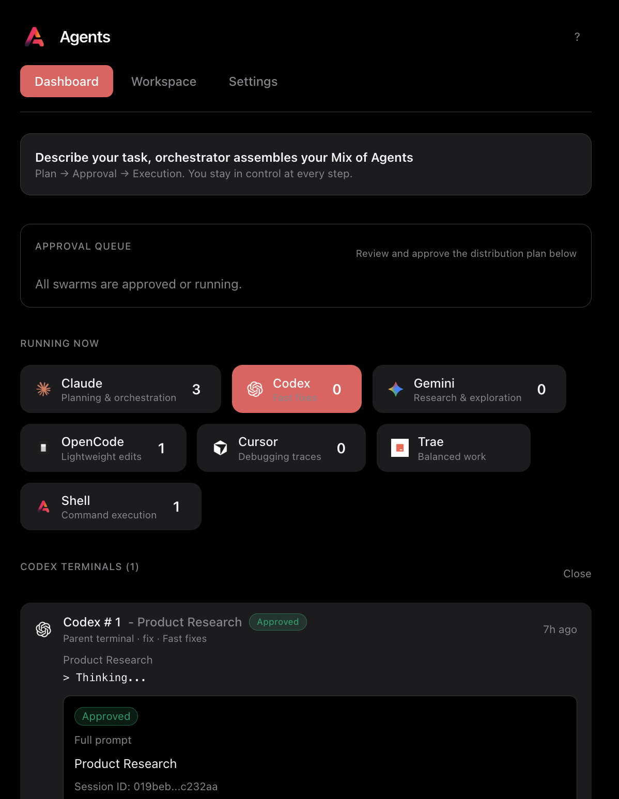

# Swarmify

[](https://marketplace.visualstudio.com/items?itemName=swarmify.swarm-ext)
[](https://www.npmjs.com/package/@swarmify/agents-mcp)
[](https://www.npmjs.com/package/@swarmify/agents-cli)
[](https://www.typescriptlang.org/)
[](./LICENSE)

You don't need a coding agent. You need a team.

[Homepage](https://swarmify.co) | [Agents Extension](https://marketplace.visualstudio.com/items?itemName=swarmify.swarm-ext) | [Agents MCP](https://www.npmjs.com/package/@swarmify/agents-mcp) | [Agents CLI](https://www.npmjs.com/package/@swarmify/agents-cli)

Run Claude, Codex, Gemini, and Cursor as a team. Orchestrate through `/swarm` with approvals before execution.

[](https://www.youtube.com/watch?v=rbeoKhDxK8E)

## Get Swarmify

**Option 1: Quick start (have agent CLIs already)**

Install the [Agents Extension](https://marketplace.visualstudio.com/items?itemName=swarmify.swarm-ext) from VS Code/Cursor marketplace, then add [Agents MCP](https://www.npmjs.com/package/@swarmify/agents-mcp):

```bash
# Claude Code
claude mcp add --scope user Swarm -- npx -y @swarmify/agents-mcp

# Codex
codex mcp add swarm -- npx -y @swarmify/agents-mcp@latest

# Gemini CLI
gemini mcp add Swarm -- npx -y @swarmify/agents-mcp
```

**Option 2: Full setup (fresh machine)**

Use [Agents CLI](https://www.npmjs.com/package/@swarmify/agents-cli) to install everything:

```bash
npm install -g @swarmify/agents-cli

# Install agent CLIs
agents cli add claude
agents cli add codex
agents cli add gemini

# Pull prompts, MCP servers, skills
agents pull

# Check what's installed
agents status
```

Then install the [Agents Extension](https://marketplace.visualstudio.com/items?itemName=swarmify.swarm-ext).

**Run your first swarm:**

```
/swarm Ship billing polish - 70% Claude planning, 30% Codex coding
```

## How It Works

| Step | What Happens |
| --- | --- |
| 1 | Run `/swarm "your task with mix needs"` |
| 2 | Lead agent creates a plan and assembles the team |
| 3 | You review and approve; agents execute in parallel |

## Why Multiple CLI Agents?

One model can't juggle research, implementation, testing, and debugging in one pass. Context windows force awkward batching. Different models have different strengths:

| Agent | CLI | Best For |
| --- | --- | --- |
| Claude | `claude` | Planning, synthesis, multi-step reasoning |
| Codex | `codex` | Fast implementation, syntax-heavy tasks |
| Gemini | `gemini` | Research depth, multi-system changes |
| Cursor | `cursor-agent` | Debugging, tracing through codebases |

Swarmify lets them work together. Claude plans while Codex implements while Cursor debugs - in parallel.

## Why CLI Agents in an IDE?

CLI agents like Claude Code, Codex, and Gemini are powerful - but running them in separate terminal windows means constant context-switching. You lose sight of your code while talking to agents.

The [Agents Extension](https://marketplace.visualstudio.com/items?itemName=swarmify.swarm-ext) gives you:

- **Full-screen terminals** - Agents run as editor tabs, not buried panels
- **Session persistence** - Close VS Code, reopen, your agent tabs come back
- **Sub-agent spawning** - Any agent can delegate to other agents via [Agents MCP](https://www.npmjs.com/package/@swarmify/agents-mcp)
- **Approval gates** - You approve plans before agents execute

## Agents Extension

Full-screen agent terminals in your IDE. Each agent becomes a tech lead that can spawn sub-agents. You become the engineering manager.

[Get it on VS Code Marketplace](https://marketplace.visualstudio.com/items?itemName=swarmify.swarm-ext)



| Shortcut | Action |
| --- | --- |
| `Cmd+Shift+A` | Spawn new agent |
| `Cmd+Shift+L` | Label agent by task |
| `Cmd+Shift+D` | Open Dashboard |
| `Cmd+Shift+G` | Generate git commit |
| `Cmd+Shift+H/V` | Split horizontal/vertical |

## Agents MCP

MCP server that turns any agent into a tech lead. Spawn sub-agents from Claude, Codex, Gemini, or any MCP client.

[Get it on npm](https://www.npmjs.com/package/@swarmify/agents-mcp)

**4 tools:** `Spawn`, `Status`, `Stop`, `Tasks`

| Mode | File Access | Use Case |
| --- | --- | --- |
| `plan` | Read-only | Research, code review |
| `edit` | Read + Write | Implementation, refactoring |
| `ralph` | Full + auto-loop | Autonomous via RALPH.md |

## Agents CLI

Install, configure, and sync all your agent CLIs from one place. Like dotfiles for AI coding tools.

[Get it on npm](https://www.npmjs.com/package/@swarmify/agents-cli)

```bash
npm install -g @swarmify/agents-cli

# Install agent CLIs
agents cli add claude
agents cli add codex
agents cli add gemini

# Upgrade (all or specific)
agents cli upgrade           # Upgrade all
agents cli upgrade claude    # Upgrade just Claude

# Sync prompts, MCP servers, hooks, skills
agents pull

# Check what's installed
agents status
```

**What gets synced:**

| Resource | Description |
| --- | --- |
| Slash commands | `/debug`, `/plan`, custom prompts |
| MCP servers | Tools your agents can use |
| Hooks | Pre/post execution scripts |
| Skills | Reusable agent capabilities |

## Developer Experience

**Slash commands** calibrated for each agent. Commands prefixed with `s` spawn multiple agents:

| Command | Description |
| --- | --- |
| `/swarm` | Multi-agent orchestration |
| `/plan` / `/splan` | Design approach / parallel validation |
| `/debug` / `/sdebug` | Root cause / parallel investigation |
| `/test` / `/stest` | Critical paths / parallel testing |
| `/ship` / `/sship` | Pre-launch / parallel verification |

**For Teams:**

- Shared dashboard keeps approvals visible
- Session logs for auditability
- Approval gates before code runs

## Common Workflows

**Multi-agent debugging:**
```
/sdebug The API returns 500 errors intermittently on /users endpoint
```

**Feature with mixed agents:**
```
/swarm Add dark mode - 50% Claude planning, 30% Codex coding, 20% Cursor testing
```

**Code review:**
```
/sconfirm Review the last 3 commits for security issues
```

## What It Costs

Swarmify is free and open source.

Each agent uses your own API keys. Spawning 3 Claude sub-agents means 3x your normal Claude API cost. No hidden fees.

## Requirements

- VS Code or Cursor
- At least one agent CLI (`claude`, `codex`, `gemini`, or `cursor-agent`)
- API keys configured for your agents

## License

MIT
