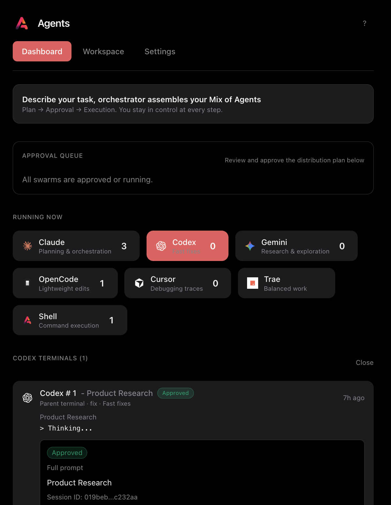

# Swarmify

[](https://marketplace.visualstudio.com/items?itemName=swarmify.swarm-ext)
[](https://www.npmjs.com/package/@swarmify/agents-mcp)
[](https://www.typescriptlang.org/)
[](./LICENSE)

Meet the future of IDEs: the Integrated Agents Environment.

[Homepage](https://swarmify.co) | [Agents Extension](https://marketplace.visualstudio.com/items?itemName=swarmify.swarm-ext) | [Agents MCP](https://www.npmjs.com/package/@swarmify/agents-mcp)

Text editors became IDEs. Now IDEs become IAEs. Swarmify turns your editor into a command center for orchestrating Claude, Codex, Gemini, and Cursor in parallel — with full visibility into every agent's work.

[](https://www.youtube.com/watch?v=rbeoKhDxK8E)

## Get Swarmify

Install the [Agents Extension](https://marketplace.visualstudio.com/items?itemName=swarmify.swarm-ext) from VS Code/Cursor marketplace, then add [Agents MCP](https://www.npmjs.com/package/@swarmify/agents-mcp):

```bash
# Claude Code
claude mcp add --scope user Swarm -- npx -y @swarmify/agents-mcp

# Codex
codex mcp add swarm -- npx -y @swarmify/agents-mcp@latest

# Gemini CLI
gemini mcp add Swarm -- npx -y @swarmify/agents-mcp
```

**Run your first swarm:**

```
/swarm Ship billing polish - 70% Claude planning, 30% Codex coding
```

## How It Works

| Step | What Happens |
| --- | --- |
| 1 | Run `/swarm "your task with mix needs"` |
| 2 | Lead agent creates a plan and assembles the team |
| 3 | You review and approve; agents execute in parallel |

## Why an IAE?

When you're running 10+ orchestrators each spinning 10+ agents, terminals and TUIs collapse. You need an environment built for that scale:

| Agent | CLI | Best For |
| --- | --- | --- |
| Claude | `claude` | Planning, synthesis, multi-step reasoning |
| Codex | `codex` | Fast implementation, surgical edits |
| Gemini | `gemini` | Research depth, multi-system changes |
| Cursor | `cursor-agent` | Debugging, tracing through codebases |

Different models have different strengths. Swarmify lets you use them all — Claude plans while Codex implements while Cursor debugs, in parallel.

## From Terminal to Environment

CLI agents are powerful — but running them in separate terminal windows means constant context-switching. You lose sight of your code, your agents, and what each one is doing.

The [Agents Extension](https://marketplace.visualstudio.com/items?itemName=swarmify.swarm-ext) gives you:

- **Full-screen terminals** - Agents run as editor tabs, not buried panels
- **Session persistence** - Close VS Code, reopen, your agent tabs come back
- **Sub-agent spawning** - Any agent can delegate to other agents via [Agents MCP](https://www.npmjs.com/package/@swarmify/agents-mcp)
- **Approval gates** - You approve plans before agents execute
- **Keyboard-first** - 12+ shortcuts for spawning, switching, labeling agents

## Agents Extension

Your IDE becomes an IAE. Each agent runs as a full-screen editor tab. Each agent can spawn sub-agents. You orchestrate.

[Get it on VS Code Marketplace](https://marketplace.visualstudio.com/items?itemName=swarmify.swarm-ext)



| Shortcut | Action |
| --- | --- |
| `Cmd+Shift+A` | Spawn new agent |
| `Cmd+Shift+L` | Label agent by task |
| `Cmd+Shift+D` | Open Dashboard |
| `Cmd+Shift+G` | Generate git commit |
| `Cmd+Shift+H/V` | Split horizontal/vertical |

## Agents MCP

MCP server that enables sub-agent spawning. Any agent can spawn any other agent — Claude can spawn Codex, Gemini can spawn Claude.

[Get it on npm](https://www.npmjs.com/package/@swarmify/agents-mcp)

**4 tools:** `Spawn`, `Status`, `Stop`, `Tasks`

| Mode | File Access | Use Case |
| --- | --- | --- |
| `plan` | Read-only | Research, code review |
| `edit` | Read + Write | Implementation, refactoring |
| `ralph` | Full + auto-loop | Autonomous via RALPH.md |

## Developer Experience

**Slash commands** calibrated for each agent. Commands prefixed with `s` spawn multiple agents:

| Command | Description |
| --- | --- |
| `/swarm` | Multi-agent orchestration |
| `/plan` / `/splan` | Design approach / parallel validation |
| `/debug` / `/sdebug` | Root cause / parallel investigation |
| `/test` / `/stest` | Critical paths / parallel testing |
| `/ship` / `/sship` | Pre-launch / parallel verification |

## Common Workflows

**Multi-agent debugging:**
```
/sdebug The API returns 500 errors intermittently on /users endpoint
```

**Feature with mixed agents:**
```
/swarm Add dark mode - 50% Claude planning, 30% Codex coding, 20% Cursor testing
```

**Code review:**
```
/sconfirm Review the last 3 commits for security issues
```

## What It Costs

Swarmify is free and open source.

Each agent uses your own API keys. Spawning 3 Claude sub-agents means 3x your normal Claude API cost. No hidden fees.

## Requirements

- VS Code or Cursor
- At least one agent CLI (`claude`, `codex`, `gemini`, or `cursor-agent`)
- API keys configured for your agents

## Agents CLI

The Agents CLI has moved to its own repository: [@swarmify/agents-cli](https://www.npmjs.com/package/@swarmify/agents-cli)

## License

MIT
