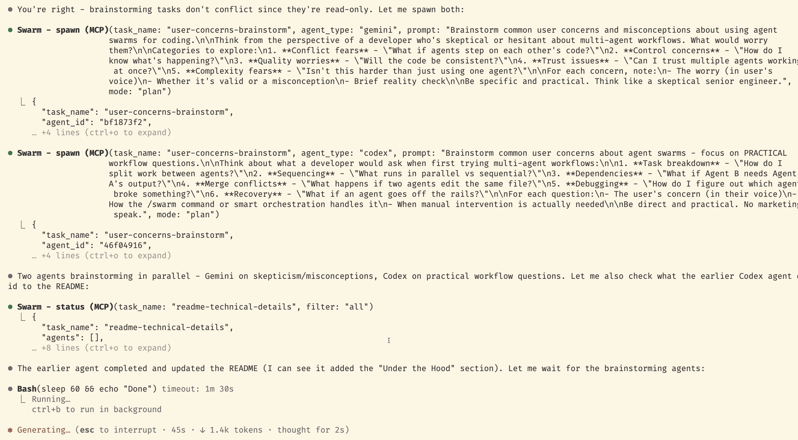

# @swarmify/agents-mcp

[](https://www.npmjs.com/package/@swarmify/agents-mcp)
[](./LICENSE)
[](https://nodejs.org)

**SubAgents and Swarms for any MCP client.** Spawn parallel agents from Claude, Codex, Gemini, or any tool that speaks MCP.

Part of [Swarmify](https://github.com/muqsitnawaz/swarmify) - multi-agent coding in your IDE.

[Homepage](https://swarmify.co/#agents-mcp) | [NPM](https://www.npmjs.com/package/@swarmify/agents-mcp) | [VS Code Extension](https://marketplace.visualstudio.com/items?itemName=swarmify.swarm-ext) | [Demo Video](https://www.youtube.com/watch?v=rbeoKhDxK8E)

## Cross-Platform Agent Orchestration

```
                         MCP Protocol
                              |
        +---------------------+---------------------+
        |                     |                     |
   Claude Code             Codex                Gemini CLI
   (MCP Client)         (MCP Client)          (MCP Client)
        |                     |                     |
        +---------------------+---------------------+
                              |
                    +-------------------+
                    |   agents-mcp      |
                    | (MCP Server)      |
                    +-------------------+
                              |
        +---------------------+---------------------+
        |                     |                     |
   claude CLI            codex CLI            gemini CLI
   (SubAgent)            (SubAgent)           (SubAgent)
```

**Any client can spawn any agent.** Claude can spawn Codex. Gemini can spawn Claude. Cursor can spawn all three. The MCP protocol is the universal interface that makes this interoperability possible.

## SubAgents and Swarms

This server enables two multi-agent patterns:

**SubAgents** - Hierarchical delegation where an orchestrator spawns specialized agents for specific tasks. Each agent works in isolation and reports back to the parent.

**Swarms** - Multiple agents working in parallel on different parts of a problem. The orchestrator coordinates, assigns non-overlapping files, and synthesizes results.

Both patterns use the same four tools. The orchestrator decides the pattern.

### Why Cross-Platform Matters

Without this server, each agent is siloed:
- Claude Code has built-in subagents, but only Claude
- Codex has no native subagent support
- Gemini CLI has no native subagent support

With this server, every MCP client gets the same capabilities. Mix models based on their strengths:

| Workflow | How It Works |
|----------|--------------|
| **Opus for planning, Codex for speed** | Use Claude Opus as orchestrator to design architecture, spawn Codex agents for fast, cheap implementation |
| **Claude for research, Cursor for code** | Claude explores codebase and plans approach, Cursor (Composer) writes the code |
| **Parallel specialists** | Claude reviews security while Codex adds validation - simultaneously |
| **Codex spawning Claude** | When Codex hits something needing deeper reasoning, it spawns Claude |

You control the cost tradeoffs. Expensive models for planning, fast models for execution.

**4 tools:** `Spawn`, `Status`, `Stop`, `Tasks`
**Modes:** `plan` (read-only), `edit` (can write), `cloud` (run on remote infra, claude/codex only). `ralph` is deprecated and will be removed in 0.4.0.
**Background processes:** Agents run headless, survive IDE restarts

## Deprecations

- **ralph mode** is deprecated as of 0.3.0 and will be removed in 0.4.0. Spawns still work but emit a warning on stderr. Migrate to a normal `spawn` with a task-list prompt, or use agents-cli's `oracle` / `supervisor` primitives.
- **effort vocabulary** changed from `fast | default | detailed` to `low | medium | high | xhigh | max | auto`. Legacy values are still accepted and map to `low | medium | high` for back-compat.
- **Storage path** moved from `~/.agents/teams/` to `~/.agents/teams/`. Old directory is left untouched; orphaned completed agents from 0.2.x no longer appear in status/tasks.

## Quick Start

```bash
npm install -g @swarmify/agents-mcp
```

That's it. The installer auto-detects Claude, Codex, and Gemini CLIs and registers with each:

```
@swarmify/agents-mcp - Auto-registering with detected agents...

  Registered with:
    + Claude Code
    + Codex
    + Gemini CLI

  Restart your agent to use Swarm tools.
```

Uninstalling (`npm uninstall -g @swarmify/agents-mcp`) automatically unregisters from all agents.

### Manual Registration

If auto-registration doesn't work or you need to register with a specific agent:

```bash
# Claude Code
claude mcp add --scope user Swarm -- npx -y @swarmify/agents-mcp

# Codex
codex mcp add swarm -- npx -y @swarmify/agents-mcp@latest

# Gemini CLI
gemini mcp add Swarm "npx -y @swarmify/agents-mcp@latest"

# Cursor / OpenCode
# Add manually via their MCP config - Name: Swarm, Command: npx -y @swarmify/agents-mcp
```

## What It Costs

This server is free and open source.

Each agent uses your own API keys. Spawning 3 Claude agents means 3x your normal Claude API cost. No hidden fees.

## Example: Swarm in Action

After installing, try this in Claude Code:

> Spawn a codex agent to add input validation to src/api/users.ts, and a claude agent to review the security implications

The orchestrating agent spawns both agents in parallel:

```
Claude Code (Orchestrator)
        |
        +-- Spawn(codex, "add input validation to src/api/users.ts")
        |         |
        |         v
        |   Codex Agent -----> modifies src/api/users.ts
        |
        +-- Spawn(claude, "review security implications")
                  |
                  v
            Claude Agent -----> analyzes changes, reports findings
        |
        +-- Status(task_name) -----> polls for completion
        |
        v
   Synthesizes results from both agents
```

The orchestrator decides when to spawn, what to assign, and how to combine results. The MCP server just provides the tools.



## API Reference

### Spawn

```
Spawn(task_name, agent_type, prompt, mode?, cwd?, effort?)
```

Start an agent on a task. Returns immediately with agent ID.

| Parameter | Required | Description |
| --- | --- | --- |
| `task_name` | Yes | Groups related agents (e.g., "auth-feature") |
| `agent_type` | Yes | `claude`, `codex`, `gemini`, or `cursor` |
| `prompt` | Yes | The task for the agent |
| `mode` | No | `plan` (default), `edit`, `cloud` (claude/codex only). `ralph` is deprecated. |
| `cwd` | No | Working directory |
| `effort` | No | `low`, `medium` (default), `high`, `xhigh`, `max`, `auto`. Legacy `fast`/`default`/`detailed` still accepted. |

### Status

```
Status(task_name, filter?, since?)
```

Get agent progress: files changed, commands run, last messages.

| Parameter | Required | Description |
| --- | --- | --- |
| `task_name` | Yes | Task to check |
| `filter` | No | `running` (default), `completed`, `failed`, `stopped`, `all` |
| `since` | No | ISO timestamp for delta updates |

### Stop

```
Stop(task_name, agent_id?)
```

Stop all agents in a task, or a specific agent by ID.

### Tasks

```
Tasks(limit?)
```

List all tasks sorted by most recent activity. Defaults to 10.

## Modes

| Mode | File Access | Auto-loop? | Use Case |
| --- | --- | --- | --- |
| `plan` | Read-only | No | Research, code review |
| `edit` | Read + Write | No | Implementation, fixes |
| `cloud` | Remote | No | Claude / Codex cloud runs, open a PR when done |
| `ralph` | Full | Yes | DEPRECATED — removed in 0.4.0. Autonomous via RALPH.md |

Default is `plan` for safety. Pass `mode='edit'` when agents need to modify files.

### Ralph Mode (deprecated)

**Deprecated in 0.3.0, will be removed in 0.4.0.** A deprecation warning is written to stderr on each ralph spawn. Migrate to a normal `spawn` with a task-list prompt, or use agents-cli's `oracle` / `supervisor` primitives.

Ralph mode spawns one agent with full permissions to autonomously work through tasks in a `RALPH.md` file. The agent reads the file, picks tasks logically, marks them complete, and continues until done.

```markdown
## [ ] Implement user authentication

Add JWT-based auth to the backend.

### Updates

---

## [x] Add rate limiting

Protect API endpoints.

### Updates
- Added sliding window counter
```

```
Spawn(mode='ralph', cwd='./my-project', prompt='Build the auth system')
```

## What This Server Does NOT Do

| Not This | That's The Orchestrator's Job |
|----------|-------------------------------|
| Scheduling | Decides when to spawn which agents |
| Task assignment | Writes prompts, defines what to do |
| Conflict resolution | Assigns non-overlapping files to agents |
| Intelligence | Pure infrastructure - no decision-making |

The server is a tool. Your orchestrating agent (Claude, etc.) decides how to use it.

## Supported Agents

| Agent | CLI | Best For |
| --- | --- | --- |
| Claude | `claude` | Complex research, orchestration |
| Codex | `codex` | Fast implementation |
| Gemini | `gemini` | Multi-system changes |
| Cursor | `cursor-agent` | Debugging, tracing |
| OpenCode | `opencode` | Provider-agnostic, open source |

## Under the Hood

### How Agents Communicate

Agents communicate through the filesystem, not shared memory:

```
Orchestrator                     SubAgent
     |                              |
     +-- Spawn ------------------>  |
     |                              |
     |                         writes to stdout
     |                              |
     |                         ~/.agents/teams/agents/{id}/stdout.log
     |                              |
     +-- Status -----------------> reads log, parses events
     |                              |
     <-- files changed, messages ---+
     |                              |
     +-- (repeat until done) -------+
```

Each agent writes to its own log file (`stdout.log`). The Status tool reads these logs, normalizes events across different agent formats, and returns a summary. This design means:

- **Persistence**: Agents survive IDE restarts. Reconnect via Status/Tasks.
- **Debugging**: Full logs available at `~/.agents/teams/agents/{id}/`
- **No shared state**: Agents don't talk to each other directly. The orchestrator coordinates.

### Storage

Data lives at `~/.agents/`:
```
~/.agents/
  config.json              # Agent configuration
  agents/
    {agent-id}/
      metadata.json        # task, type, mode, status
      stdout.log           # Raw agent output
```

**Plan mode** is read-only:
- Claude: `--permission-mode plan`
- Codex: sandboxed
- Gemini/Cursor: no auto-approve

**Edit mode** unlocks writes:
- Claude: `acceptEdits`
- Codex: `--full-auto`
- Gemini: `--yolo`
- Cursor: `-f`

## Configuration

Config lives at `~/.agents/teams/config.json`. See [AGENTS.md](./AGENTS.md) for full config reference.

## Environment Variables

| Variable | Description |
| --- | --- |
| `AGENTS_MCP_DEFAULT_MODE` | Default mode (`plan` or `edit`) |
| `AGENTS_MCP_RALPH_FILE` | Task file name (default: `RALPH.md`) |
| `AGENTS_MCP_DISABLE_RALPH` | Set `true` to disable ralph mode |

## Works great with the extension

This MCP server works standalone with any MCP client. For the best experience - full-screen agent terminals, session persistence, fast navigation - install the [Agents extension](https://marketplace.visualstudio.com/items?itemName=swarmify.swarm-ext) for VS Code/Cursor.

## License

MIT
